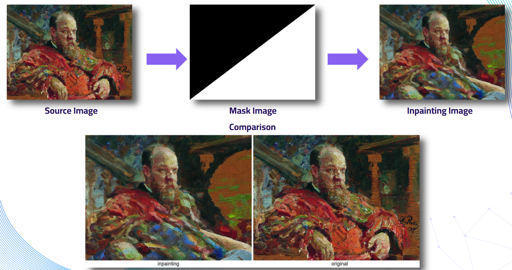
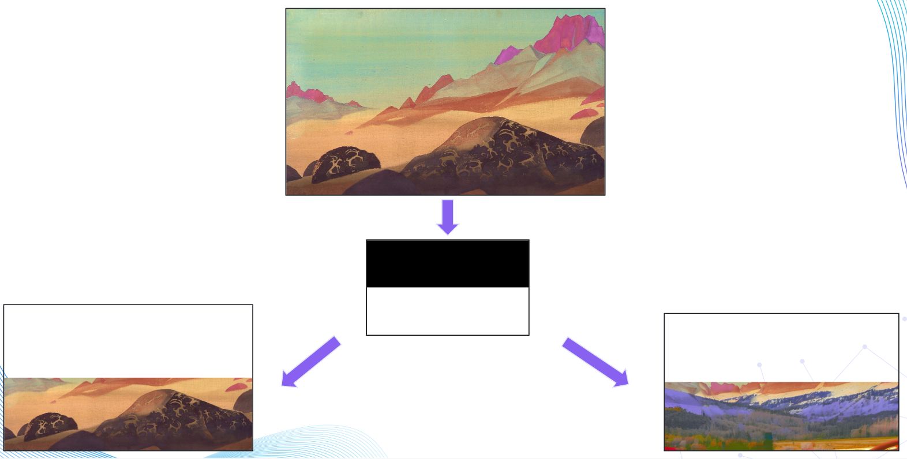
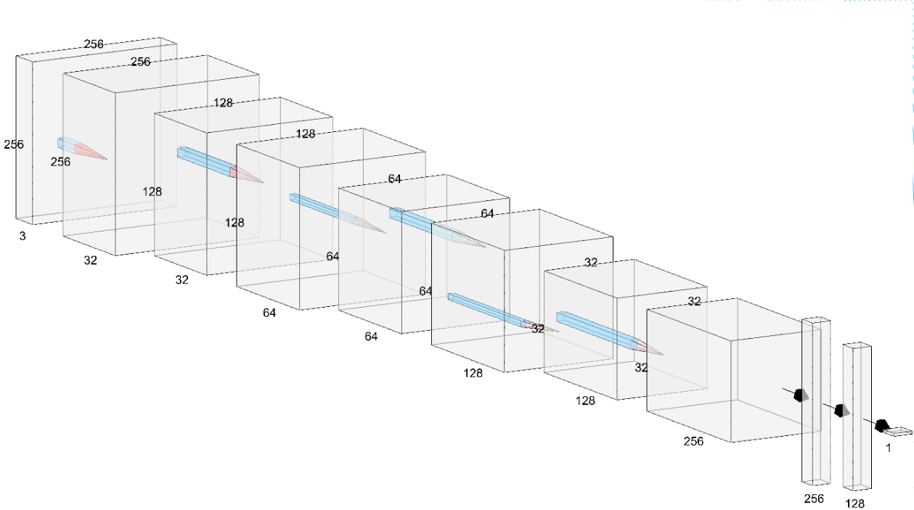
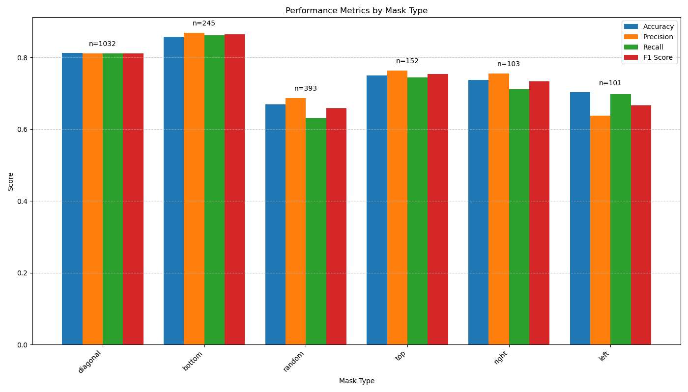

# Art Inpainting Detection

A deep learning project for detecting AI-generated inpainting in artwork. This repository contains code for preprocessing, training, and evaluating models that can identify regions of images that have been modified using AI inpainting techniques.

## Dataset

Dataset link at: [kaggle](https://www.kaggle.com/datasets/danielmao2019/deepfakeart)
The dataset used in this project was sourced from Kaggle and consists of:
- 5,063 original artwork images
- 5,063 inpainted versions of the same images

The inpainted images were generated by feeding masked original images through a Stable Diffusion model. The masking indicates regions where the AI should apply inpainting. Five primary mask types were used:

- Left region
- Right region
- Top region
- Bottom region
- Diagonal regions
- Random regions


*Examples of different mask types applied to original images*

## Preprocessing Pipeline

### Masking Application

We apply the original masks to both the original and inpainted images for the following reasons:

1. Masking inpainted images highlights the regions where AI manipulation has occurred
2. Masking original images establishes a consistent baseline for how unmanipulated regions should appear under the same masking conditions
3. This approach helps prevent the model from learning to detect the presence of masks themselves as indicators of manipulation, which could lead to false positives in real-world applications


*Preprocessing pipeline: original image, mask, masked original, and masked inpainted image*

### Image Processing

- Images are resized to 256×256 pixels
- Lanczos resampling is applied during resizing to preserve texture details
- During exploratory data analysis, we found that inpainted images had slightly lower edge density than original images, making texture preservation important

## Model Architectures

We experimented with three primary model architectures:

### 1. ResNet50

- Pretrained on ImageNet
- Experimented with unfreezing the last 1-2 blocks for fine-tuning
- Achieved approximately 60% accuracy

### 2. EfficientNetV2

- Pretrained on ImageNet
- Experimented with unfreezing later blocks
- Achieved approximately 57% accuracy

### 3. Custom CNN

- 5 convolutional blocks with skip connections
- Dropout with batch normalization in dense layers
- CosineDeclayRestart learning rate scheduler
- Achieved approximately 72% accuracy


*Architecture of the custom CNN model*

## SVM Classifier Enhancement

Research paper link at: 
Based on research suggesting that replacing the final layer with an SVM classifier can improve performance, we:

1. Extracted features from the CNN's GlobalAveragePooling2D layer
2. Used HalvingGridSearchCV to determine optimal kernel and hyperparameters for the SVM
3. Trained SVM classifiers on these extracted features

This approach improved accuracy to 78%, representing a 6% improvement over the CNN alone.

## Performance by Mask Type

When analyzing performance by mask type, we found that:

- Best performance: Bottom, Diagonal, Top masking
- Moderate performance: Right, Left masking
- Worst performance: Random masking

This pattern is expected as random masking presents more complex and varied inpainting challenges.


*Model performance broken down by mask type*

## Usage

### Prerequisites

The project requires the following dependencies, which are listed in `requirements_cnn.txt`:

```
tensorflow>=2.9.0
scikit-learn>=1.0.0
numpy>=1.19.0
pillow>=8.0.0
opencv-python>=4.5.0
matplotlib>=3.3.0
```

You can install them using:

```bash
pip install -r requirements_cnn.txt
```

### Complete Pipeline - Training and SVM

You can run the complete pipeline (training and SVM classification) using:

```bash
python scripts/run_detector.py
```

This script allows you to:
- Prepare and process the dataset
- Train a model (CNN, ResNet, or EfficientNet)
- Evaluate the model
- Train an SVM classifier on the extracted features

You can modify the configuration variables at the top of the script to control which parts of the pipeline to run:

```python
PREPARE_DATA = False    # Whether to prepare and process the dataset
TRAIN_SVM = True        # Whether to train an SVM classifier on features

# Configure the detector
detector = InpaintingDetector(
    config_name='efficientNet',
    image_size=256,
    batch_size=16,
    max_epochs=25,
    unfreeze=True,
    unfreeze_epoch=2,
    unfreeze_block=['block5', 'block6', 'block7'],
    learning_rate=1e-4,
    model_type="efficientNet"  # Options: "cnn", "resnet", "efficientNet"
)
```

### Training SVM on a Pre-trained Model

If you already have a trained model and want to train an SVM classifier on its features:

```bash
python scripts/run_svm.py
```

You'll need to update the `MODEL_PATH` variable in the script to point to your trained model.

## Project Structure

```
├── dataset/
│   ├── inpainting/
├── experiments/
│   └── [timestamp]_[model_type]/
│       ├── weights/
│       ├── figures/
│       └── svm/
├── scripts/
│   ├── run_detector.py
│   ├── run_svm.py
├── src/
│   ├── inpainting_detector.py
│   ├── model_architecture.py
│   ├── preprocess_image.py
│   ├── svm.py
│   ├── training.py
│   ├── visualize.py
│   └── unfreeze_layers.py
├── requirements_cnn.txt
└── README.md
```

## Future Improvements

- Experiment with attention mechanisms to better focus on inpainted regions
- Test with different inpainting models beyond Stable Diffusion
- Create a localization model that can highlight the specific inpainted regions

## License

This project is licensed under the MIT License - see the LICENSE file for details.